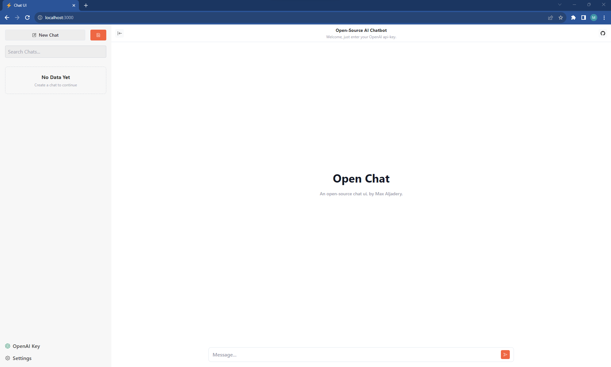

# Chat UI

Chat UI is an open-source alternative to the ChatGPT UI. It allows you to interact with the OpenAI api in an open-source environment.

This code shows you what you can do with streaming, and more. It also includes a list of some useful prompts that are pre-selected.



[Demo](https://www.loom.com/share/963fb2c13cf6400fac71771ece1050cf?sid=b6a6c13b-54d3-413c-82e6-a2d3e2e02909)

[chat.maxaljadery.com](https://chat.maxaljadery.com)


## Deployment

### Dev
This will run the entire NextJS application.

```bash
npm install && npm run dev
```


### Production
```bash
npm install && npm run build && npm run start
```

## License

All code is under an MIT License.